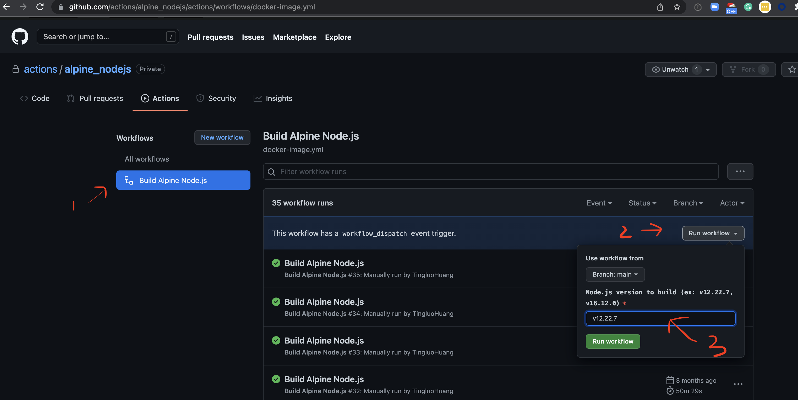
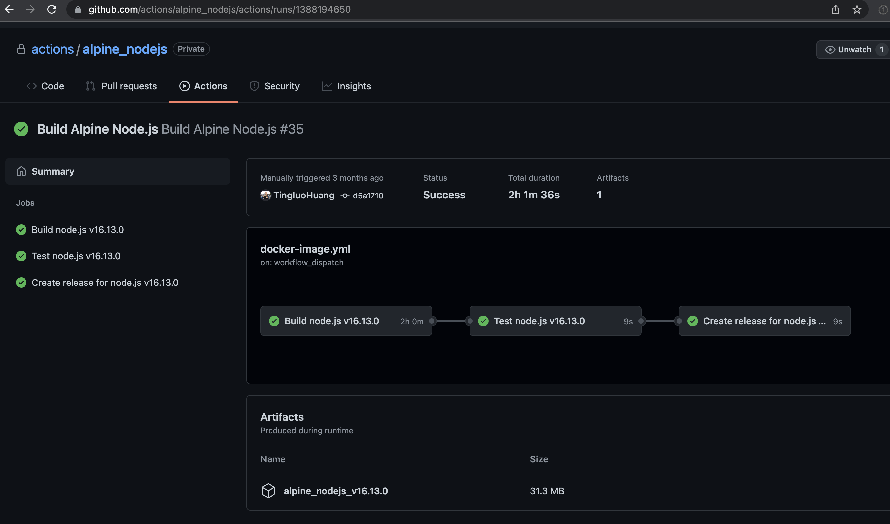
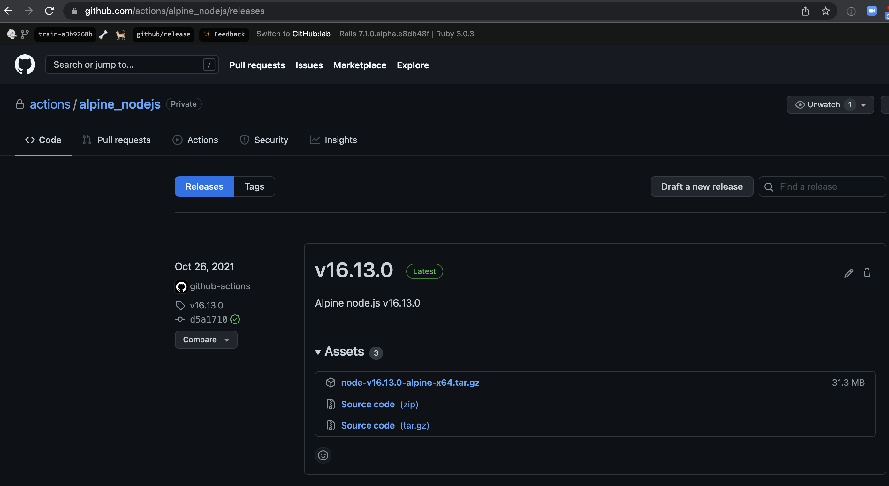

# alpine_nodejs

[GitHub Actions Runner](https://github.com/actions/runner/blob/main/src/Misc/externals.sh) download alpine node.js from https://vstsagenttools.blob.core.windows.net/tools/nodejs

The [workflow](https://github.com/TingluoHuang/alpine_nodejs/actions/workflows/docker-image.yml) in this repository can compile a partial-static node.js for alpine and create a [GitHub release](https://github.com/TingluoHuang/alpine_nodejs/releases) for it.

- Queue workflow using `workflow_dispatch` trigger and set the `node` version you want to compile as input, ex: `v12.22.7`

- Wait for the run to complete

- There should be a newly created release that matches the version you want for `node`, and it is able to run on alpine.

- Once we get [approval](https://github.com/github/open-source-releases/issues/205) to change the current repository from `private` to `public`, then we can consume the release assets directly. In the meantime, you will need to follow [instructions](https://dev.azure.com/mseng/AzureDevOps/_wiki/wikis/AzureDevOps.wiki/4037/How-to-upload-resource-to-vstsagenttools.blob.core.windows.net) to check-in the compiled alpine node.js from the release assets as a `Git-LFS` files to https://dev.azure.com/mseng/AzureDevOps/_git/CIPlat.Externals and get it mirror into https://vstsagenttools.blob.core.windows.net/tools/nodejs
> Tips for working with `CIPlat.Externals` repository:  
> - The repository is huge right now, you don't want to waste your time and disk space to get those unrelated files.
>   - Ignore LFS files during initial `git clone` the repo with `GIT_LFS_SKIP_SMUDGE=1 git clone https://mseng@dev.azure.com/mseng/AzureDevOps/_git/CIPlat.Externals`
>   - Ignore LFS files during any `git checkout` or `git fetch` operation with `GIT_LFS_SKIP_SMUDGE=1`.
>   - You do want the LFS smudge filter to run during `git add` and `git push`, make sure you don't have `GIT_LFS_SKIP_SMUDGE=1` when you run `git add` and `git push`.
> - More `Git-LFS` doc is at https://github.com/git-lfs/git-lfs/tree/main/docs
